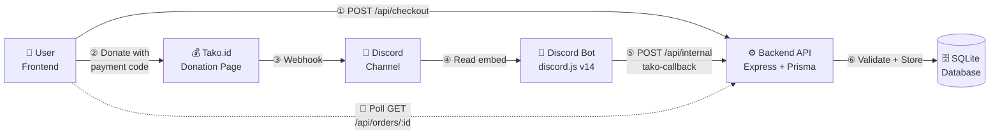

# Tako Payment Gateway

Automated payment gateway using [Tako.id](https://tako.id) donation page + Discord webhook as indirect payment callback.

## Architecture



## Features

- **Checkout flow** — user picks product, gets unique payment code (`ORD-XXXXXX`), donates on Tako with that code
- **Automatic detection** — Discord bot reads Tako webhook messages, extracts sender + amount
- **Payment validation** — payment code match, amount match, expiry check, dedup by `discord_message_id`
- **Fulfillment** — auto-creates entitlements (subscription with duration, digital items, etc.)
- **Admin panel** — manage products, view orders, monitor payment logs
- **Idempotent** — duplicate messages safely ignored
- **Reusable as library** — `lib/` exports `createPaymentGateway()` and `createDiscordBot()`

## Quick Start

### Prerequisites

- Node.js 18+
- [Discord Bot Token](https://discord.com/developers/applications) with Message Content Intent enabled
- [Tako.id](https://tako.id) creator account with Discord webhook configured

### 1. Clone & Install

```bash
git clone https://github.com/aldirahmanhh/takoPayment.git
cd takoPayment
npm install
```

### 2. Environment Setup

```bash
cp .env.example .env
```

Edit `.env` and fill in:

```env
# Discord Bot
DISCORD_TOKEN=your_discord_bot_token

# Tako Webhook
TAKO_WEBHOOK_CHANNEL_ID=discord_channel_id_here

# Backend
JWT_SECRET=random-secret-string
INTERNAL_API_KEY=random-internal-key

# Database
DATABASE_URL="file:./dev.db"

# Tako (change if using different creator)
TAKO_CREATOR_USERNAME=anrizz
TAKO_URL=https://tako.id/anrizz

# Order expiry in minutes (default: 15)
ORDER_EXPIRY_MINUTES=15
```

### 3. Initialize Database

```bash
npx prisma db push
```

### 4. Seed a Product

Open SQLite database and insert a product:

```sql
INSERT INTO products (id, name, description, price, type, duration_days, is_active)
VALUES ('prod_vip', 'VIP Access', 'Full VIP access for 30 days', 10000, 'subscription', 30, 1);
```

Or use the admin panel after starting the server.

### 5. Run

```bash
npm start
```

- **API**: http://localhost:3000/api
- **Checkout page**: http://localhost:3000/checkout.html
- **Admin panel**: http://localhost:3000/admin.html (register/login first)

## Payment Flow

1. User registers/logs in on the checkout page (or your frontend)
2. User selects a product and clicks "Buy"
3. Backend creates an `Order` + `PaymentIntent` with a unique payment code (e.g., `ORD-A8K2X9`)
4. User is shown: "Donate IDR 10,000 to Tako with sender name: `ORD-A8K2X9`"
5. User donates at `https://tako.id/anrizz` using the payment code as the sender name
6. Tako sends a Discord webhook notification to the configured channel
7. Discord bot parses the embed, extracts the payment code and amount
8. Bot forwards data to `POST /api/internal/tako-callback`
9. Backend validates:
   - `discord_message_id` is unique (prevents double-processing)
   - Payment code matches an active `PaymentIntent`
   - Amount matches expected amount
   - Order hasn't expired
   - Order isn't already paid
10. If valid → Order status → `PAID`, entitlement created
11. User's frontend (polling) detects `PAID` status → success page

## API Endpoints

| Method | Endpoint | Auth | Description |
|--------|----------|------|-------------|
| `POST` | `/api/auth/register` | — | Register (email, username, password) |
| `POST` | `/api/auth/login` | — | Login, returns JWT |
| `GET` | `/api/auth/me` | JWT | Get current user |
| `GET` | `/api/products` | — | List active products |
| `GET` | `/api/products/:id` | — | Get product detail |
| `POST` | `/api/checkout` | JWT | Create order + payment intent |
| `GET` | `/api/orders` | JWT | List user's orders |
| `GET` | `/api/orders/:id` | JWT | Get order status (for polling) |
| `POST` | `/api/internal/tako-callback` | Internal Key | Discord bot → backend |

## Use as a Library

You can install this as an npm package and mount it in any Express app:

```js
const express = require('express');
const { createPaymentGateway } = require('@anrizz/bot-payment');

const app = express();
app.use('/api', createPaymentGateway({
  JWT_SECRET: process.env.JWT_SECRET,
  INTERNAL_API_KEY: process.env.INTERNAL_API_KEY,
}));

app.listen(3000);
```

### Running the Discord Bot Separately

```js
const { createDiscordBot } = require('@anrizz/bot-payment/lib/bot');

createDiscordBot({
  DISCORD_TOKEN: process.env.DISCORD_TOKEN,
  TAKO_WEBHOOK_CHANNEL_ID: process.env.TAKO_WEBHOOK_CHANNEL_ID,
  INTERNAL_API_KEY: process.env.INTERNAL_API_KEY,
  BACKEND_URL: 'http://localhost:3000',
});
```

## Project Structure

```
├── lib/                          # Core library
│   ├── index.js                  # createPaymentGateway() export
│   ├── bot.js                    # createDiscordBot() export
│   ├── config.js                 # Environment config
│   ├── prisma.js                 # Prisma client
│   ├── errors.js                 # AppError class
│   ├── generate-payment-code.js  # ORD-XXXXXX generator
│   ├── middleware/
│   │   └── auth.js               # JWT + Internal Key middleware
│   ├── routes/
│   │   ├── auth.js               # Register, login, me
│   │   ├── products.js           # Product listing
│   │   ├── checkout.js           # Create order
│   │   ├── orders.js             # User orders
│   │   └── internal.js           # Bot callback endpoint
│   └── services/
│       ├── tako-callback.js      # Payment validation + processing
│       └── fulfillment.js        # Entitlement creation
├── src/                          # Consumer app example
│   ├── index.js                  # Entry point
│   └── routes/
│       └── admin.js              # Admin panel routes
├── prisma/
│   └── schema.prisma             # Database schema
├── public/
│   ├── checkout.html             # Frontend checkout page
│   └── admin.html                # Admin dashboard
├── .env.example                  # Environment template
└── README.md
```

## Database Schema

| Table | Purpose |
|-------|---------|
| `users` | User accounts (email, username, hashed password) |
| `products` | Sellable products (name, price, type, duration) |
| `orders` | Checkout orders (PENDING → PAID/EXPIRED/CANCELLED) |
| `payment_intents` | Payment tracking with unique codes |
| `payment_logs` | All Tako webhook events (successes + failures) |
| `entitlements` | Fulfillment records (ACTIVE/EXPIRED/REVOKED) |

## Tech Stack

- **Runtime**: Node.js
- **Framework**: Express.js
- **Discord**: discord.js v14
- **Database**: SQLite (via Prisma ORM)
- **Auth**: JWT + bcryptjs
- **Frontend**: Vanilla HTML/CSS/JS + Tailwind CSS (CDN)

## License

GNU GPL v3 — see [LICENSE](LICENSE) for full text.

This program is free software: you can redistribute it and/or modify it under the terms of the GNU General Public License. Anyone using, modifying, or distributing this code must keep the original copyright notice and license intact.

© 2026 anrizz
